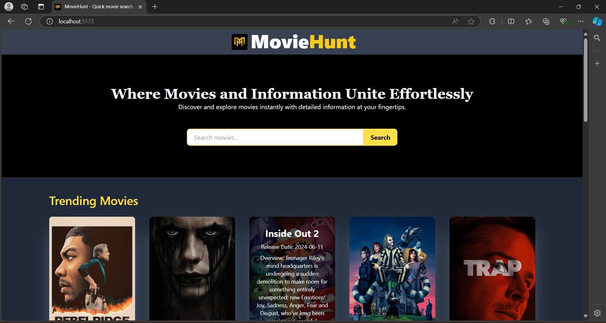

# MovieHut - Movie Information App

MovieHut is a simple web application built with React.js and Tailwind CSS. It allows users to search for movies and display detailed information, including the movie's title, release date, synopsis, and more, using an external API. This project demonstrates basic API integration, state management, and responsive design using modern frontend technologies.

**Live Demo -** [MovieHut](https://movie-hunt-anand-yellojus-projects.vercel.app/)

## Table of Contents

- [Screenshots](#screenshots)
- [Installation](#installation)
- [Usage](#usage)
- [Features](#features)
- [Technologies Used](#technologies-used)
- [Contributing](#contributing)
- [Credits](#credits)
- [License](#license)
<!--
## Screenshots



## Installation

To set up this project locally, follow these steps:

1. Clone the repository:
    ```bash
    git clone https://github.com/anandyelloju/movie-hunt.git
    ```
2. Navigate to the project directory:
    ```bash
    cd movie-hut
    ```
3. Install the dependencies:
    ```bash
    npm install
    ```
4. Start the development server:
    ```bash
    npm run dev
    ```

## Usage

After installation, you can run the project locally using the development server. The app includes the following features:

- **Search Bar:** Allows users to search for their favorite movies.
- **Movie Details:** Displays detailed information such as the title, release date, and synopsis.
- **Responsive Design:** Optimized for various screen sizes.

## Features

- **Movie Search:** Easily search for movies and get detailed information using an API.
- **Responsive Design:** Ensures a smooth user experience on both desktop and mobile devices.
- **API Integration:** Fetches real-time data from a movie API.

## Technologies Used

- **React.js:** JavaScript library for building user interfaces.
- **Tailwind CSS:** Utility-first CSS framework for styling.
- **Vite:** Fast frontend tooling for development.
- **External API:** Used to fetch movie data dynamically.

[](https://skillicons.dev)

## Contributing

Contributions are always welcome! - If you have suggestions or improvements.

## Credits

- **React.js:** For providing a powerful framework for building UIs.
- **Tailwind CSS:** For flexible and customizable styling.
- **Vite:** For efficient and fast development.
- **External API:** For real-time movie data.
- [Anand Yelloju](https://github.com/anandyelloju) - Project Creator

## License

This project is licensed under the [MIT License](https://choosealicense.com/licenses/mit/) - see the [LICENSE](https://github.com/your-github-username/movie-hut/blob/main/LICENSE) file for details.
